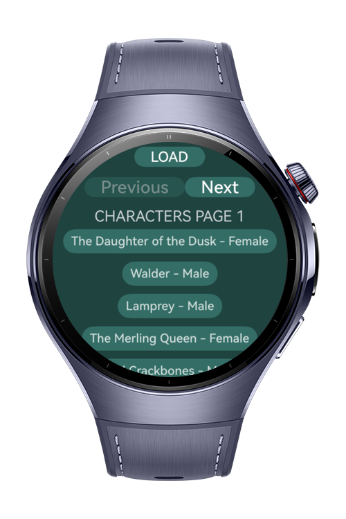
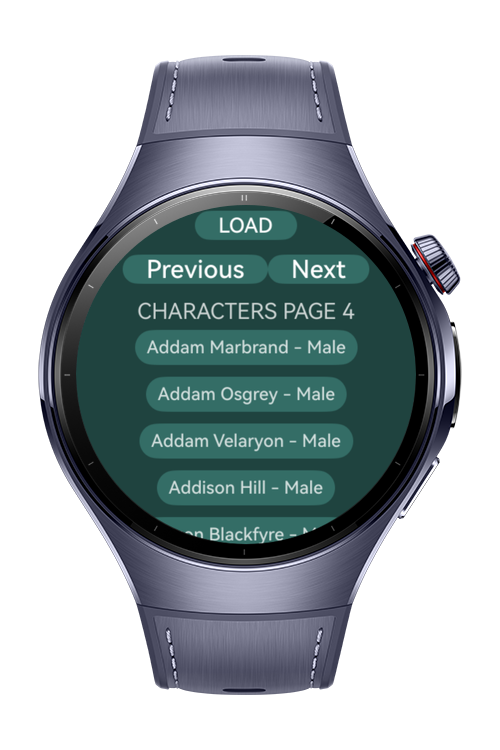

> **Note:** To access all shared projects, get information about environment setup, and view other guides, please visit [Explore-In-HMOS-Wearable Index](https://github.com/Explore-In-HMOS-Wearable/hmos-index).

# How To Make Pagination

Pagination Feature is a demo page that loads and displays paginated data from a remote API using ArcList or List components, allowing the user to navigate between pages using next and previous buttons.

# Preview

<div>
  
  
</div>

# Tech Stack

Languages: ArkTS
Frameworks: HarmonyOS SDK 5.1.0(18)
Tools: DevEco Studio Vers 5.1.0.820
Libraries: `@kit.ArkUI`, `@kit.RemoteCommunicationKit`

# Use Cases

PaginationApp lets users:
Browse large datasets or long lists (e.g., products, articles, records) without performance issues.
Navigate through content page by page instead of loading everything at once.


# Directory Structure
   ```
   entry/src/main/ets/
   |---pages
   | |---PaginationPage.ets
   |---view
   | |---PaginationComponent.ets
   |---viewmodel
   | |---PaginationModel.ets
   ```

# Constraints and Restrictions
## Supported Devices
Huawei Watch 5

# LICENSE

BaristaRecipes is distributed under the terms of the MIT License.  
See the [LICENSE](/LICENSE) for more information.

